# OmniFlow Architecture And Operating Guide

**Version:** 0.4.0 (controlled alpha)
**Audience:** Omni product management and engineering
**Repositories:** [atx-omni/OmniFlow](https://github.com/atx-omni/OmniFlow), [exploreomni/OmniFlow](https://github.com/exploreomni/OmniFlow)

---

## 1. Executive Summary

OmniFlow is an open-source CI/CD companion for Omni semantic-layer development. It runs as a GitHub Action in a customer's repository, validates Omni model and content changes before merge, and can synchronize Omni after a production dbt deployment.

This document covers the full architecture and, in detail, the two policies added to solve a specific customer problem: **safely collapsing a dbt + Omni monorepo from two branches down to one.**

### The Customer Problem

A customer runs a monorepo (dbt + Omni + Hightouch) with two branches: `main` for dbt and `omni-main` as Omni's Git base branch, plus a merge-forward workflow. It is safe but clunky, and Omni's history diverges from the repository's.

They cannot simply merge the branches because of a timing gap. Omni promotes authored model YAML **the moment a pull request merges**, via its Git-integration webhook. When a change renames or drops a warehouse column, Omni starts referencing the new schema before dbt has deployed it, and production content breaks in the window between merge and deployment.

### What We Built

Two complementary policies, both optional and disabled by default:

| Policy | Direction covered |
|---|---|
| **Breaking Change Hold** | A breaking **Omni** change merging ahead of its dbt deployment |
| **dbt Impact Analysis** | A **dbt** change orphaning a reference the Omni model still holds |

### The Central Constraint

**OmniFlow cannot intercept Omni's webhook.** No API consumer can. Promotion on merge is Omni platform behavior.

What OmniFlow does instead is prevent the **unsafe merge**. By the time anything reaches the base branch, either the change is additive (safe to promote immediately) or the dbt deployment has already landed. This is enforced at the GitHub branch-protection layer through a required check.

An administrative merge bypass still produces the gap. A complete guarantee would require an Omni-side promotion gate, which is not currently in Omni's public API. That is the "interrupt mechanism" this customer has been asking product for, and it remains the correct long-term answer.

---

## 2. System Architecture

### 2.1 Component Overview

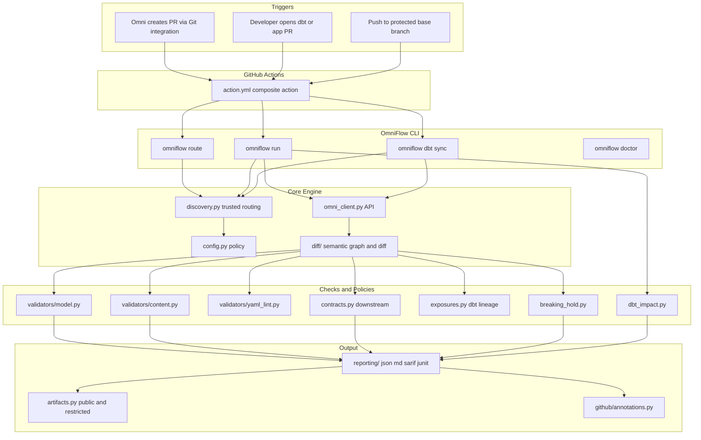

### 2.2 Module Inventory

| Module | Responsibility |
|---|---|
| `cli.py` | Argparse entry point and orchestration for every subcommand |
| `config.py` | `.omniflow.yml` parsing, strict schema validation, env overrides |
| `discovery.py` | Trusted routing from `.omni/flow.json`, changed-file inventory, PR marker |
| `omni_client.py` | Omni REST client: pagination, retry, bounded responses, redaction |
| `diff/semantic_graph.py` | Builds a graph of models, views, topics, fields, relationships |
| `diff/diff_engine.py` | Classifies changes and assigns risk (`info` → `breaking`) |
| `diff/yaml_loader.py` | Bounded, secure YAML loading |
| `validators/model.py` | Omni model validation API results and policy |
| `validators/content.py` | Content Validator results, history, new-only policy |
| `validators/yaml_lint.py` | Semantic lint rules |
| `contracts.py` | Maps breaking changes to referencing dashboards and queries |
| `exposures.py` | Optional dbt exposure lineage enrichment |
| `dbt_sync.py` | Post-deployment schema refresh with job polling |
| **`breaking_hold.py`** | **Breaking Change Hold policy** |
| **`dbt_impact.py`** | **dbt Impact Analysis cross-reference** |
| **`dbt_manifest.py`** | **dbt manifest parsing for precise column truth** |
| **`dbt_sql_diff.py`** | **Conservative SQL heuristic column extraction** |
| `security.py` | Redaction, path validation, secret rejection |
| `trust.py` | Reads config only from trusted base-branch sources |
| `artifacts.py` | Public and restricted artifact separation |
| `reporting/` | JSON, Markdown, SARIF, JUnit renderers |
| `repair/` | Unreleased AI repair scaffold, disabled |

### 2.3 Trust Model

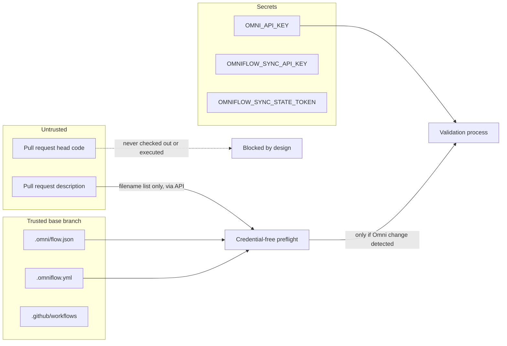

Design rules enforced in code:

- The workflow uses `pull_request_target` but **never checks out or executes PR head code**
- A credential-free `omniflow route` preflight decides whether the secret is needed at all
- `base_url`, `model_id`, and policy come only from the protected base branch
- A PR marker may select among registered models; it **cannot** supply `base_url`
- Fork PRs never receive the Omni secret; fork PRs touching Omni files fail closed
- Omni-like files outside registered model paths fail closed

### 2.4 Exit Codes

| Code | Meaning |
|---|---|
| `0` | Success, or an intentional skip |
| `1` | Validation or policy gate failed |
| `2` | Configuration or discovery error |
| `3` | Authentication or authorization error |
| `4` | Omni API error |
| `5` | Security policy violation |
| `6` | Internal error |

---

## 3. Policy Design

### 3.1 Breaking Change Hold

Evaluates only changes the semantic diff marks `breaking`: `field_deleted`, `field_renamed`, `field_type_changed`, `relationship_deleted`, `relationship_cardinality_changed`.

Two detection modes:

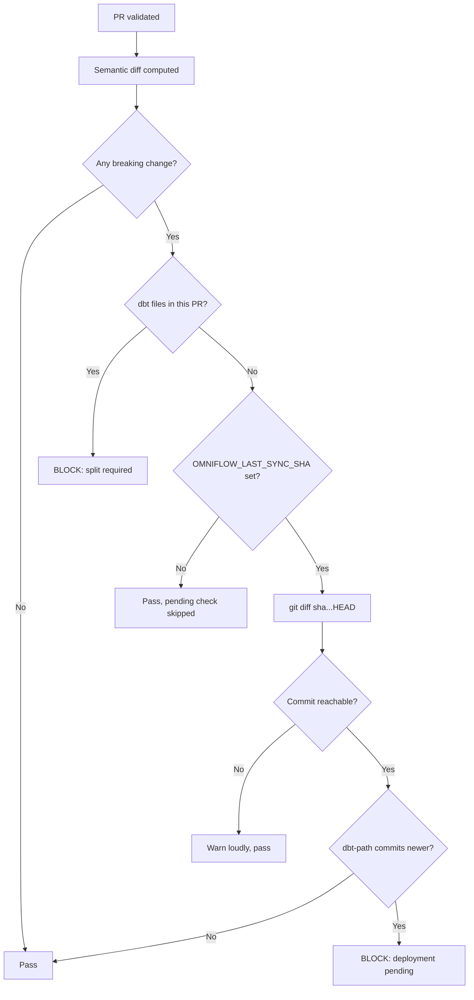

Config:

```yaml
deployment:
  breaking_change_hold:
    enabled: true
    action: fail            # or warn
    dbt_paths: [models, seeds, snapshots, macros]
    pending_label: omniflow/awaiting-deploy
```

**Sync state mechanism.** After `omniflow dbt sync` succeeds, the deployment workflow records `GITHUB_SHA` as the repository variable `OMNIFLOW_LAST_SYNC_SHA`. Pull-request validation reads it as an action input and compares dbt-path commits against it. Writing a repository variable requires more than the default `GITHUB_TOKEN`, so a fine-grained `OMNIFLOW_SYNC_STATE_TOKEN` is used.

**Fail-open on weak evidence.** If the SHA is unset or unreachable (shallow checkout), OmniFlow prints a loud stderr warning and evaluates same-PR detection only. It does not block a merge on incomplete history, and it does not silently pretend to be protecting the branch.

### 3.2 dbt Impact Analysis

Runs on pull requests that OmniFlow would otherwise **skip**: dbt-path changes with no Omni model changes.

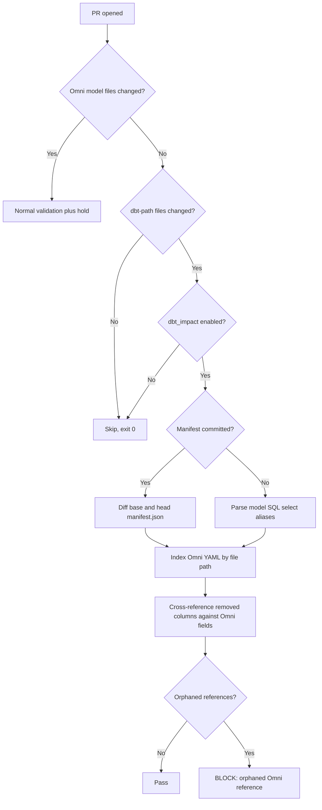

Config:

```yaml
checks:
  dbt_impact:
    enabled: true
    manifest_path: target/manifest.json
    fail_on_orphaned_references: true
    omni_yaml_paths: [omni]        # defaults to .omni/flow.json model paths
    table_mapping:                 # only for custom schema macros
      - dbt_model: orders_v2
        sql_table_name: analytics.marts.orders
```

**Runs without an Omni credential.** This is pure static analysis over committed files, which is why it can occupy the previously-skipped path. No Omni API call, no warehouse query, no dbt invocation.

**Two modes.** Manifest mode uses `nodes[].columns` and `nodes[].relation_name` for exact truth. Heuristic mode parses the final top-level `SELECT` for aliases, stripping Jinja and comments, and deliberately reports nothing for `SELECT *` or unparseable SQL rather than inventing findings.

**View indexing by file path.** Discovered during real-repo testing: `build_graph` keys views by name, so three `dim_product.view.yaml` files across different schemas collapsed into one entry (37 files produced 11 views), hiding two views from the check. `dbt_impact.py` therefore builds its own index keyed by file path. `build_graph` was left unchanged because the diff engine depends on its behavior.

**Ambiguity is reported, not guessed.** When an unqualified relation name matches several distinct Omni relations, the finding carries `ambiguous_relation_match: true` and `candidate_relations`, and lists every candidate's orphaned fields.

---

## 4. Process Flows By Example

Each flow below is a distinct path a real pull request can take.

### Example 1: Omni-Only Repository

No dbt in the repository. Baseline OmniFlow behavior.

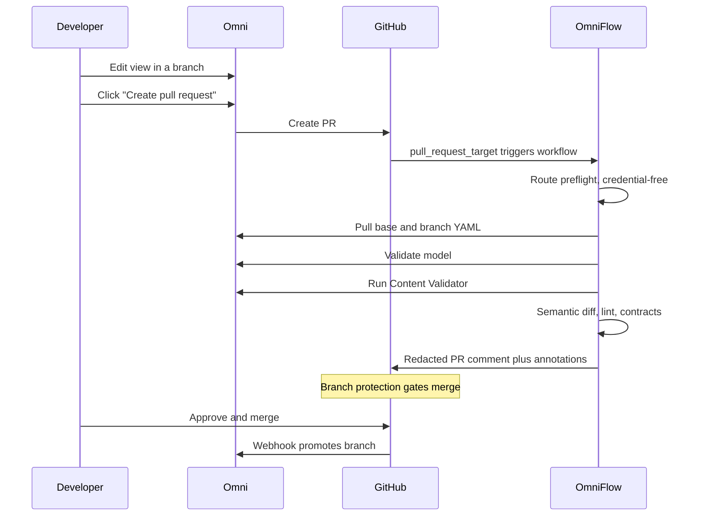

**Blocks on:** model validation errors, Content Validator issues under new-only policy, a renamed or deleted field referenced by published content.

### Example 2: Two-Branch Monorepo (Current Customer State)

`main` for dbt, `omni-main` for Omni.

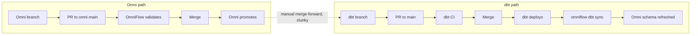

Safe, but the merge-forward step is manual and Omni's history diverges from the repository's. This is what the customer wants to eliminate.

### Example 3: Single Branch, Additive Change

The common case. No policy intervention.

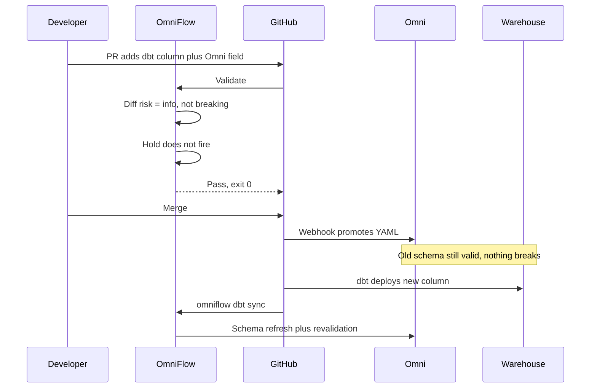

### Example 4: Single Branch, Breaking Change In One PR

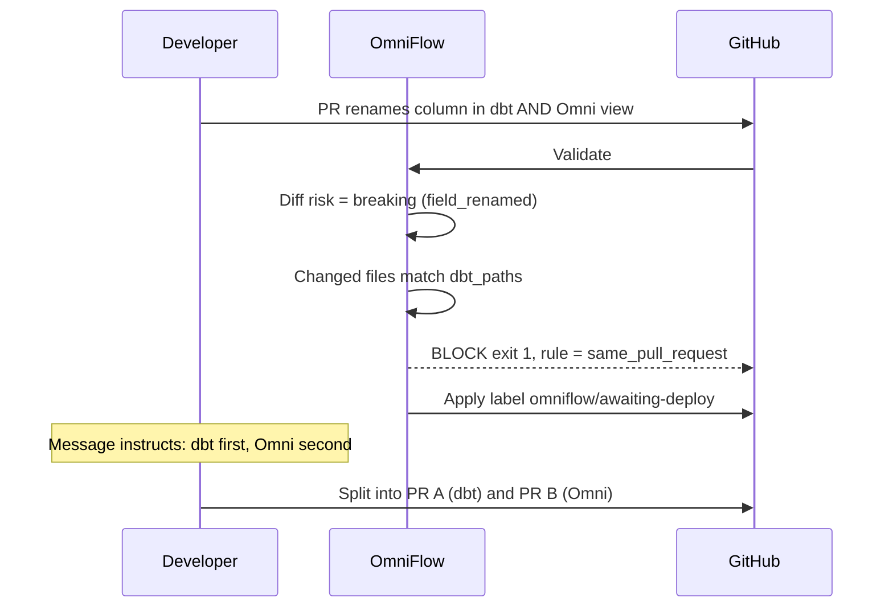

**Why blocking is correct:** merging this promotes Omni YAML referencing `customer_key` while the warehouse still has `customer_id`. Every dashboard on that field fails until dbt deploys.

### Example 5: Breaking Change, Wrong Order (Pending Deployment)

PR A (dbt) has merged and awaits deployment. PR B (Omni) opens.

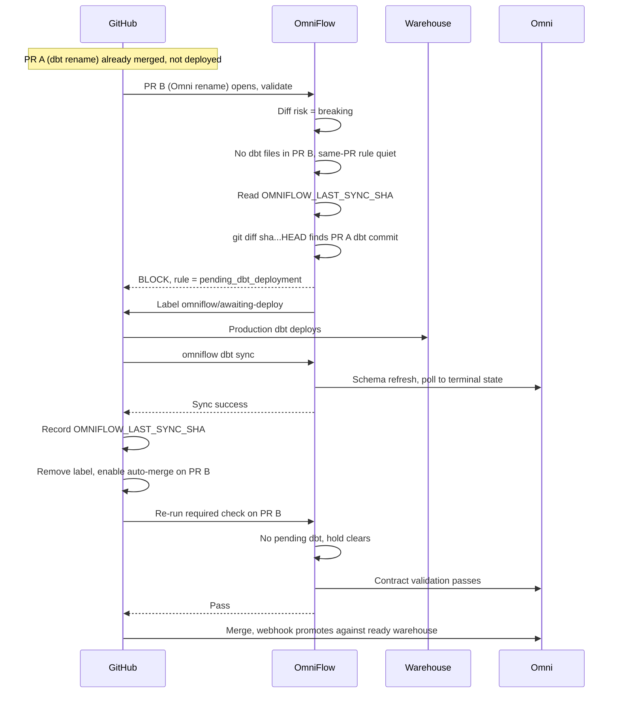

### Example 6: Two dbt-Only PRs (Impact Analysis)

Neither PR touches Omni. Previously both merged and broke production on deploy.

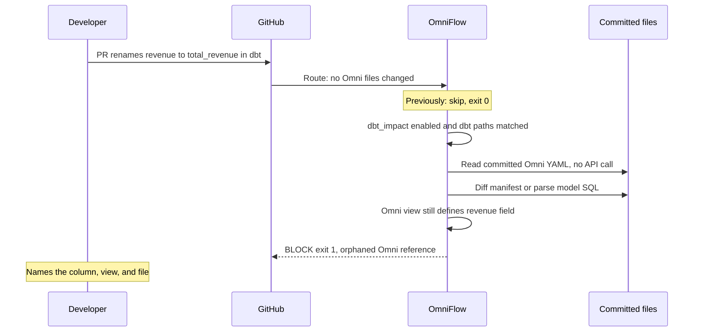

**Ambiguity variant.** When several schemas hold the same table name and the model reference is unqualified:

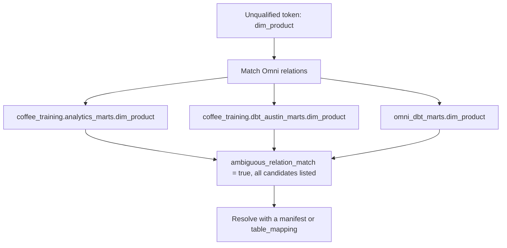

### Example 7: Fork Pull Request

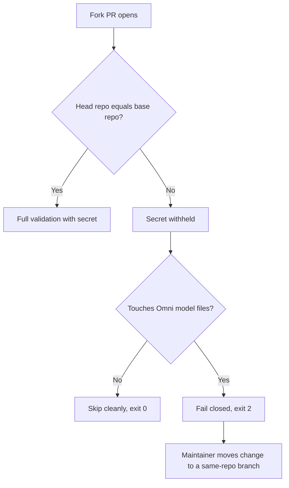

### Example 8: Post-Deployment Synchronization

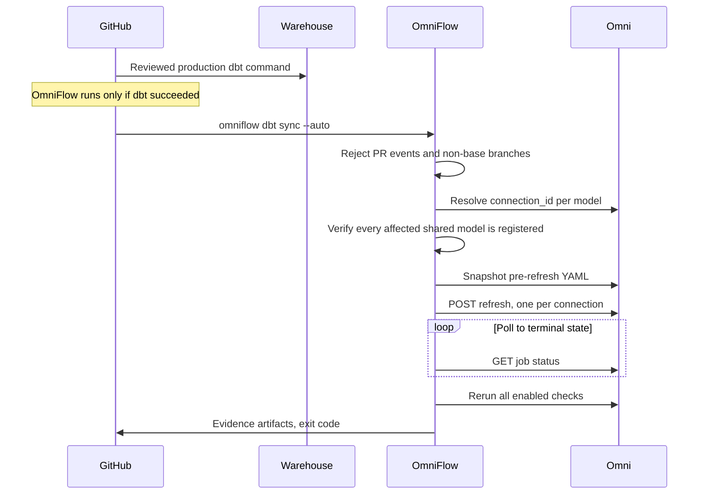

---

## 5. Decision Matrix

| Situation | Hold | Impact | Result |
|---|---|---|---|
| Additive Omni change | quiet | n/a | Pass |
| Additive Omni plus dbt, same PR | quiet | n/a | Pass |
| Breaking Omni, no downstream references | quiet | n/a | Warning, pass |
| Breaking Omni referenced by a dashboard | quiet | n/a | Fail, contract violation |
| Breaking Omni plus dbt, same PR | **fires** | n/a | Fail, split required |
| Breaking Omni, dbt deployment pending | **fires** | n/a | Fail, held until sync |
| Breaking Omni, dbt current | quiet | n/a | Pass |
| dbt-only, removes referenced column | n/a | **fires** | Fail, orphaned reference |
| dbt-only, removes unreferenced column | n/a | quiet | Pass |
| dbt-only, adds a column | n/a | quiet | Pass |
| dbt-only, deletes a referenced model | n/a | **fires** | Fail, orphaned view |
| Fork PR, no Omni files | n/a | n/a | Skip, exit 0 |
| Fork PR with Omni files | n/a | n/a | Fail closed, exit 2 |

---

## 6. Installation

### 6.1 Prerequisites

- Omni model already using Git integration and Branch Mode against the target repository
- Omni pull-request webhook configured
- GitHub plan supporting branch protection on the repository
- A dedicated least-privilege Omni service user and personal access token

### 6.2 Files

| File | Location | Purpose |
|---|---|---|
| `.omni/flow.json` | Protected base branch | Non-secret model identity: `base_url`, `model_id`, `model_path`, `base_branch` |
| `.omniflow.yml` | Protected base branch | Optional policy |
| `.github/workflows/omniflow.yml` | Protected base branch | Validation workflow, action pinned to a reviewed SHA |
| `.github/workflows/omniflow-dbt-sync.yml` | Protected base branch | Deployment workflow with sync and release |

### 6.3 Secrets And Variables

| Name | Type | Used by | Scope |
|---|---|---|---|
| `OMNI_API_KEY` | Secret | Validation | Read model, validate, Content Validator, list branches |
| `OMNIFLOW_SYNC_API_KEY` | Environment secret | dbt sync | Modeler, or Connection Admin for multi-model connections |
| `OMNIFLOW_SYNC_STATE_TOKEN` | Secret | Sync state recording | Repository variables, read and write, single repo |
| `OMNIFLOW_LAST_SYNC_SHA` | Variable | Pending detection | Written by the deployment workflow |

### 6.4 Full Single-Branch Policy

```yaml
contracts:
  enabled: true
  fail_on:
    deleted_referenced_fields: true
    renamed_referenced_fields: true
    referenced_field_type_changes: true
    referenced_join_cardinality_changes: true
    coverage_gaps: true

checks:
  content_validation:
    enabled: true
    fail_on_new_only: true
  model_validation:
    enabled: true
  semantic_lint:
    enabled: true
  dbt_impact:
    enabled: true
    manifest_path: target/manifest.json
    fail_on_orphaned_references: true

deployment:
  dbt_sync:
    enabled: true
    refresh_mode: hard
    post_sync_validation: true
  breaking_change_hold:
    enabled: true
    action: fail
    dbt_paths: [models, seeds, snapshots, macros]
    pending_label: omniflow/awaiting-deploy

security:
  redaction_level: standard
  retain_restricted_artifacts: false
```

### 6.5 Checkout Requirement

Pending-deployment detection compares a recorded commit against `HEAD`, so that commit must be reachable. Set `fetch-depth: 0` on the validation checkout when the hold is enabled. With a shallow checkout OmniFlow warns and evaluates same-PR detection only.

### 6.6 Recommended Rollout

1. Install validation only; leave both new policies disabled. Confirm a live Omni PR validates.
2. Make the OmniFlow check required in branch protection.
3. Enable `dbt_sync` against a non-production connection. Confirm refresh and revalidation.
4. Enable `breaking_change_hold` with `action: warn`. Observe for a week.
5. Enable `dbt_impact` with `fail_on_orphaned_references: false`. Tune `dbt_paths` and add `table_mapping` entries as needed.
6. Promote both to blocking once the false-positive rate is acceptable.
7. Add the release workflow so held PRs auto-merge after sync.

---

## 7. Evidence And Privacy

Every run writes root and redacted public summaries:

```text
.omniflow/
  report.json
  report.md
  report.sarif
  junit.xml
  evidence.json
  dbt-sync.json              # dbt synchronization runs
  dbt-impact.json            # impact analysis runs
  artifact-manifest.json
  public/
  restricted/<model_id>/
```

- Public reports exclude API keys, raw payloads, email addresses, document URLs, and folder paths
- `security.redaction_level: strict` additionally removes content names, query names, owners, labels, and free-text messages
- Restricted artifacts are deleted by default and are never uploaded by the example workflows
- Raw response output cannot be enabled in CI policy; `--unsafe-raw-output` exists only on a local debugging command
- No module persists warehouse rows, query results, or compiled SQL

---

## 8. Verification Status

### 8.1 Automated

| Suite | Result |
|---|---|
| Unit tests | 281 passing |
| Alpha simulations | 21 passing |
| `ruff` | Clean |
| `bandit` | Clean |
| Coverage | 79% overall; `dbt_impact` 81%, `dbt_manifest` 82%, `dbt_sql_diff` 93%, `breaking_hold` 93% |

### 8.2 Real-Repository Validation

Tested against [atx-omni/coffee-omni-training](https://github.com/atx-omni/coffee-omni-training), a genuine dbt plus Omni monorepo:

| Test | Outcome |
|---|---|
| Rename `standard_unit_price` in `dim_product.sql` | Blocked, exact column, view, and file named |
| Drop a referenced column | Blocked |
| Add a column | Passed with an informative note |
| Delete a dbt model | Blocked, orphaned view rule |
| Breaking Omni view plus dbt model, same PR | Held, same-PR rule |
| Additive Omni plus dbt | Passed |
| Qualified relation match | Precise, single schema, not flagged ambiguous |
| Unqualified match across three schemas | All candidates reported, flagged ambiguous |

That testing surfaced the view-name collision defect described in section 3.2. It would have shipped silently otherwise.

### 8.3 Not Yet Verified — Required Before Customer Reliance

- The **live release loop**: recording `OMNIFLOW_LAST_SYNC_SHA` via fine-grained token, label apply and remove, `gh pr merge --auto` completing under real branch protection
- Whether Omni's **model validation API** flags a field whose SQL references a column absent from the warehouse
- **Pending-deployment detection** against a real `fetch-depth: 0` checkout with a genuinely recorded sync SHA
- A customer's dbt project shape mapping cleanly to `dbt_paths` and producing a usable manifest

The recommendation is to run this gate on `coffee-omni-training` first: it has a real Omni model, real Git integration, and is non-production.

---

## 9. Known Limitations

### 9.1 Architectural

| Limitation | Consequence |
|---|---|
| Cannot intercept Omni's webhook | An admin merge bypass still produces the gap |
| Never queries the warehouse | Cannot confirm whether a column exists today |
| Does not run dbt | Relies on committed artifacts or file diffs |
| Evaluates PRs independently | No concept of a coordinated PR pair |

### 9.2 Detection

| Limitation | Mitigation |
|---|---|
| Hold detection is path-based, not semantic | Narrow `dbt_paths`; unrelated `models/` edits alongside breaking Omni changes are still held |
| Heuristic mode cannot resolve Jinja, macros, `ref()`, `source()` | Commit a dbt manifest |
| Custom schema macros break name-based mapping | Add `table_mapping` entries |
| Word-boundary column matching can over-report | Review `orphaned_fields` before assuming a break |
| Unqualified relations are ambiguous across schemas | Reported explicitly; resolve with a manifest |
| Pending detection needs history and a recorded SHA | `fetch-depth: 0` plus `OMNIFLOW_SYNC_STATE_TOKEN` |

### 9.3 Known Interaction: Coordinated Rename Deadlock

The two policies are individually correct but can conflict on a coordinated rename:

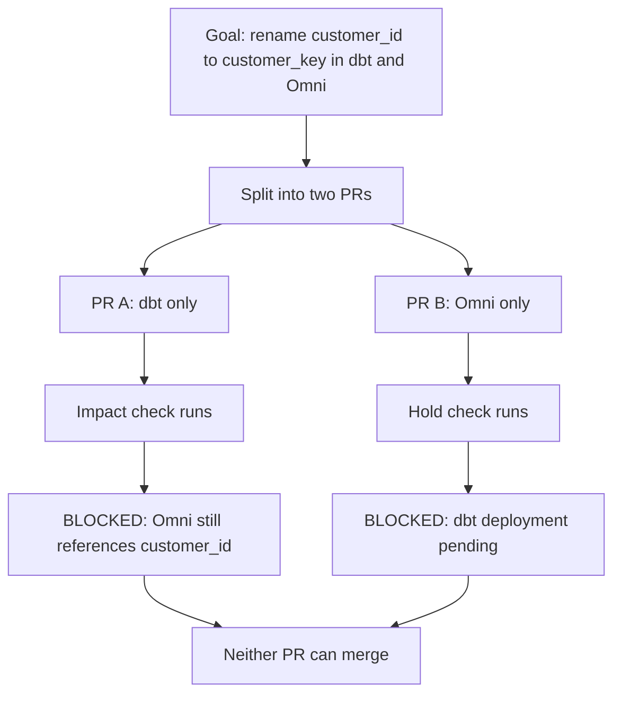

**Current workarounds:**

- Run `dbt_impact` with `fail_on_orphaned_references: false` during coordinated migrations
- Run `breaking_change_hold` with `action: warn` and rely on reviewer discipline for the ordering
- Merge the dbt PR with an explicit admin override, deploy, sync, then merge the Omni PR normally

**Proposed resolution (not built).** A coordinated-change marker, for example a shared label or a PR-body reference, that tells OmniFlow two PRs are a pair. The impact check would then suppress an orphan finding when a paired Omni PR resolving that exact column is open, and the hold would release the Omni PR as soon as its paired dbt PR deploys. This is the natural next feature and should be scoped only if the customer hits it in practice.

---

## 10. Product Recommendations

Ordered by leverage.

1. **Omni promotion gate API.** The only complete fix for the merge-to-promotion window. A way to hold or defer shared-model promotion until released would let any CI tool close the gap fully, and it is what this customer originally asked for. **High** value.

2. **Machine-readable Omni PR metadata.** Omni's PR description guarantees a branch-content link, but no documented stable payload carries the host and model ID. OmniFlow therefore requires committed `.omni/flow.json` bootstrap metadata and deliberately refuses to send a token to a host parsed from PR text. A documented payload would remove that setup step. **Medium** value.

3. **Document whether model validation resolves against live warehouse schema.** This determines whether a dangling column reference is already caught for free. It changes how much detection logic any CI tool needs. **Medium** value, low cost.

4. **Documented Modeling Agent mutation API.** The AI repair scaffold in the repository remains disabled because the documented AI Jobs API is query-oriented and does not expose branch editing. **Low** urgency.

---

## 11. References

### OmniFlow Documentation

- [Installation](https://github.com/atx-omni/OmniFlow/blob/main/docs/INSTALLATION.md)
- [Configuration reference](https://github.com/atx-omni/OmniFlow/blob/main/docs/CONFIGURATION.md)
- [Breaking Change Hold](https://github.com/atx-omni/OmniFlow/blob/main/docs/BREAKING_CHANGE_HOLD.md)
- [dbt Impact Analysis](https://github.com/atx-omni/OmniFlow/blob/main/docs/DBT_IMPACT.md)
- [Post-Deployment dbt Synchronization](https://github.com/atx-omni/OmniFlow/blob/main/docs/DBT_SYNC.md)
- [Testing matrix](https://github.com/atx-omni/OmniFlow/blob/main/docs/TESTING.md)
- [Security model](https://github.com/atx-omni/OmniFlow/blob/main/docs/SECURITY_MODEL.md)
- [Troubleshooting](https://github.com/atx-omni/OmniFlow/blob/main/docs/TROUBLESHOOTING.md)

### Omni Official

- [Branch Mode](https://docs.omni.co/content/develop/branch-mode)
- [Git integration settings](https://docs.omni.co/integrations/git/settings)
- [Git integration best practices](https://docs.omni.co/integrations/git/best-practices)
- [Model YAML API](https://docs.omni.co/api/models/get-model-yaml)
- [Model validation API](https://docs.omni.co/api/models/validate-model)
- [Content Validator API](https://docs.omni.co/api/content-validator/validate-content)
- [Refresh schema API](https://docs.omni.co/api/models/refresh-schema)
- [Job status API](https://docs.omni.co/api/jobs/get-job-status)
- [dbt exposures API](https://docs.omni.co/api/dbt/get-dbt-exposures)
- [Schema refresh behavior](https://docs.omni.co/modeling/develop/schema-refreshes)

### GitHub

- [Secure use of Actions](https://docs.github.com/en/actions/reference/security/secure-use)
